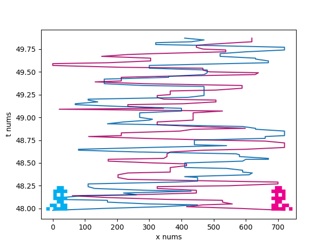

# PT_Library_Python_UltimatePythotev
PT_Library_Python_UltimatePythotev is a public repository which contains a collection of libraries and demos written in Python.  
These are mostly simple scripts for personal use which could come in handy in personal projects, especially ones usings Raspberry Pi.

Some of those are:
- Libraries
	- pythotevLibEmailSender.py - creates a SMTP client and makes it easy for one to send emails;
	- pythotevLibHttpFootballApi.py - uses the **v3.football.api-sports.io** API in order to gather some football data on demand;
	- pythotevLibHttpWeatherApi.py - uses the **api.openweathermap.org** API to get some weather data;
	- pythotevLibLogger.py - a tiny library to log information in a txt file;
	- pythotevLibTextToMp3.py - the library steps on **gtts** and **os** in order to reads out a text file into a newly created .mp3 file.
- Demos
	- pythotevDemoTapoP100LampOn - this one is particularly useful example of Python code acessing a **Tapo P100 Wi-Fi Socket** within a LAN network.